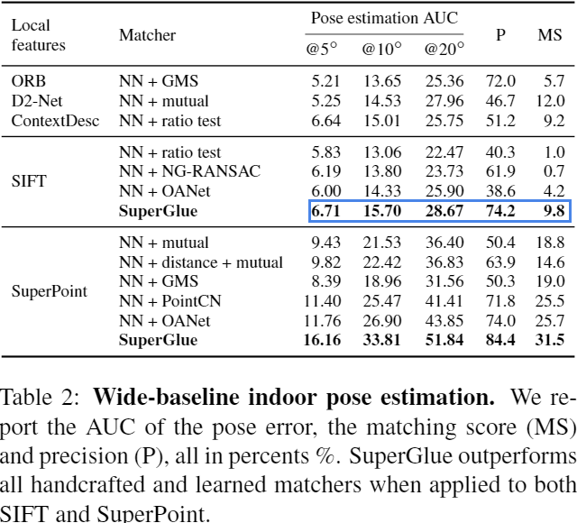
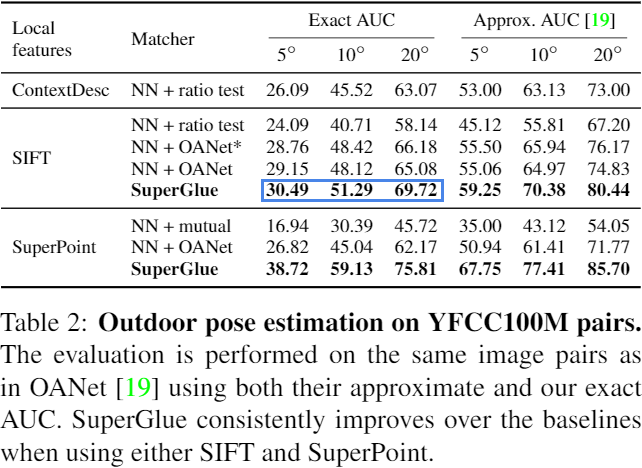
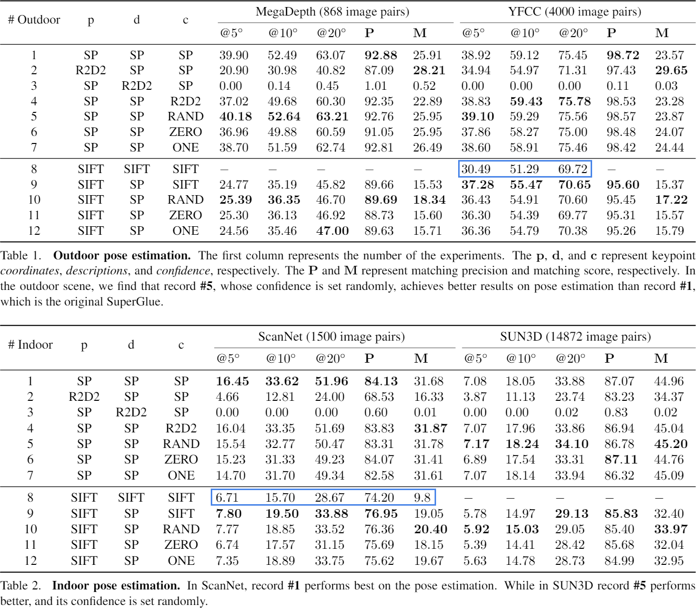

# Branch 🌿 SIFT-SIFT-SIFT

|                                    Experiments                                    	|  p   |  d   |  c   |
| :--------------------------------------------------------------------------------------:	| :--: | :--: | :--: |
| [main](https://github.com/Xylon-Sean/Detector-oblivious-keypoint-matcher/tree/main)		|  --  |  --  |  --  |
| [#1](https://github.com/Xylon-Sean/Detector-oblivious-keypoint-matcher/tree/SP-SP-SP)		|  SP  |  SP  |  SP  |
| [#2](https://github.com/Xylon-Sean/Detector-oblivious-keypoint-matcher/tree/R2D2-SP-SP)	| R2D2 |  SP  |  SP  |
| [#3](https://github.com/Xylon-Sean/Detector-oblivious-keypoint-matcher/tree/SP-R2D2-SP)	|  SP  | R2D2 |  SP  |
| [#4](https://github.com/Xylon-Sean/Detector-oblivious-keypoint-matcher/tree/SP-SP-R2D2)	|  SP  |  SP  | R2D2 |
| [#5](https://github.com/Xylon-Sean/Detector-oblivious-keypoint-matcher/tree/SP-SP-RAND)	|  SP  |  SP  | RAND |
| [#6](https://github.com/Xylon-Sean/Detector-oblivious-keypoint-matcher/tree/SP-SP-ZERO)	|  SP  |  SP  | ZERO |
| [#7](https://github.com/Xylon-Sean/Detector-oblivious-keypoint-matcher/tree/SP-SP-ONE)	|  SP  |  SP  | ONE  |
|👉[#8](https://github.com/Xylon-Sean/Detector-oblivious-keypoint-matcher/tree/SIFT-SIFT-SIFT)| SIFT | SIFT | SIFT |
| [#9](https://github.com/Xylon-Sean/Detector-oblivious-keypoint-matcher/tree/SIFT-SP-SIFT)	| SIFT |  SP  | SIFT |
|[#10](https://github.com/Xylon-Sean/Detector-oblivious-keypoint-matcher/tree/SIFT-SP-RAND)	| SIFT |  SP  | RAND |
|[#11](https://github.com/Xylon-Sean/Detector-oblivious-keypoint-matcher/tree/SIFT-SP-ZERO)	| SIFT |  SP  | ZERO |
|[#12](https://github.com/Xylon-Sean/Detector-oblivious-keypoint-matcher/tree/SIFT-SP-ONE)	| SIFT |  SP  | ONE  |

---

#### This experiment results are copied from the [SuperGlue paper](https://openaccess.thecvf.com/content_CVPR_2020/html/Sarlin_SuperGlue_Learning_Feature_Matching_With_Graph_Neural_Networks_CVPR_2020_paper.html).

<b>[ 🖱️ Click to show the result tables]</b>

	

