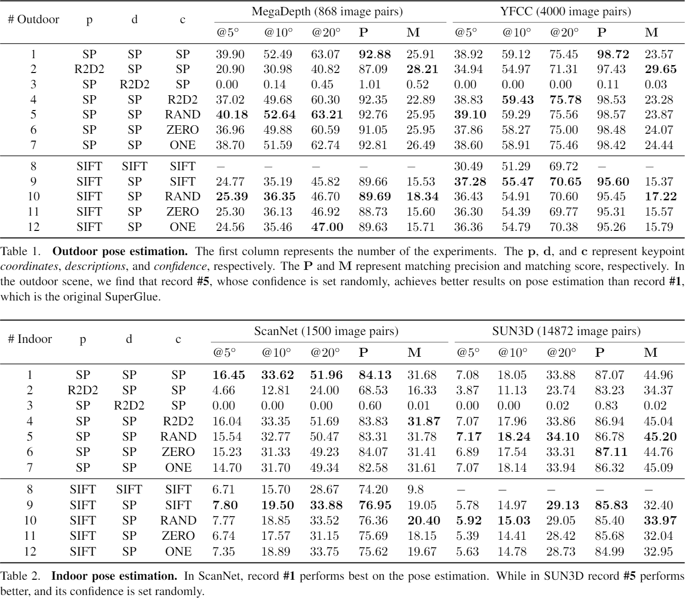

This repository is a Pytorch implementation for the **Detector-oblivious** part of [the paper](https://arxiv.org/abs/2104.00947).

> Xuelun Shen, Cheng Wang, Xin Li, Qian Hu, Jingyi Zhang. "A Detector-oblivious Multi-arm Network for Keypoint Matching."

---

## Environment

This code is based on `Python (3.8.8)` and `Pytorch (py3.8_cuda11.1_cudnn8.0.5_0)`, and tested on `Ubuntu 18.04` with `GeForce RTX 3090`.

You could also use other environments and GPU, as long as the code can run successfully, and should be able to get similar results as in the paper.

You could install necessary packages by the command below:

```bash
pip install numpy opencv-python matplotlib imagesize tqdm h5py imageio
```

---

## Usage

### Get the data

Download datasets in the compressed file `data-DETO.zip` from [Google drive](https://drive.google.com/file/d/1qWrZjy1lYe6tB8OWE-Q07HcG5ycm3Fnn/view?usp=sharing), unzip it and rename the folder from `data-DETO` to `data`.

### Get pretrained model

Download pretrained model in the compressed file `weights-DETO.zip` from [Google drive](https://drive.google.com/file/d/1T5nmIrA13LfSpoKHMAvbXEd0HLcfHAnw/view?usp=sharing), unzip it and rename the folder from `weights-DETO` to `weights`.

### Prepare directory structure

Put the `data` folder into the source code folder.

Put the `weight` folder into the `models` folder.

If we name the source code folder as `DETO`.

The directory structure should be like this:

<details>
<summary><b>[Click to show the file structure]</b></summary>

```bash
DETO
│
└───assets
│
└───data
│	│
│	└───MegaDepth
│	│
│	└───scannet
│	│
│	└───sun3d
│	│
│	└───yfcc
│
└───models
    │
    └───weights
		│
		└───r2d2_WASF_256d.pt
		│
		└───r2d2_WASF_N16.pt
		│
		└───superglue_indoor.pth
		│
		└───superglue_outdoor.pth
		│
		└───superpoint_v1.pth
```
</details>

## Reproduce

We use **branch** in git to manage different experimental settings, and name the branch using the **p-d-c** format that are from the table above.

For example, if we switch the branch from **main** to **SP-SP-SP**, and then run the code under this branch (**SP-SP-SP**), we will get the **#1** experimental result in the table.

<details>
<summary><b>[Click to show the result tables]</b></summary>

<p align="center">
	
</p>
</details>

Therefore, in addition to branch **main**, this repository also contains **12** branches, corresponding to the **12** experiment numbers in the table above.

By comparing the source code of different branches, we can easily observe which changes have affected performance.

**TODO: add Pycharm compare snapshot**

<details>
<summary><b>[Click to switch the branch]</b></summary>

|                                    Experiments                                    	|  p   |  d   |  c   |
| :--------------------------------------------------------------------------------------:	| :--: | :--: | :--: |
| [main](https://github.com/Xylon-Sean/Detector-oblivious-keypoint-matcher/tree/main)		|  --  |  --  |  --  |
| [#1](https://github.com/Xylon-Sean/Detector-oblivious-keypoint-matcher/tree/SP-SP-SP)		|  SP  |  SP  |  SP  |
| [#2](https://github.com/Xylon-Sean/Detector-oblivious-keypoint-matcher/tree/R2D2-SP-SP)	| R2D2 |  SP  |  SP  |
| [#3](https://github.com/Xylon-Sean/Detector-oblivious-keypoint-matcher/tree/SP-R2D2-SP)	|  SP  | R2D2 |  SP  |
| [#4](https://github.com/Xylon-Sean/Detector-oblivious-keypoint-matcher/tree/SP-SP-R2D2)	|  SP  |  SP  | R2D2 |
| [#5](https://github.com/Xylon-Sean/Detector-oblivious-keypoint-matcher/tree/SP-SP-RAND)	|  SP  |  SP  | RAND |
| [#6](https://github.com/Xylon-Sean/Detector-oblivious-keypoint-matcher/tree/SP-SP-ZERO)	|  SP  |  SP  | ZERO |
| [#7](https://github.com/Xylon-Sean/Detector-oblivious-keypoint-matcher/tree/SP-SP-ONE)	|  SP  |  SP  | ONE  |
|[#8](https://github.com/Xylon-Sean/Detector-oblivious-keypoint-matcher/tree/SIFT-SIFT-SIFT)| SIFT | SIFT | SIFT |
| [#9](https://github.com/Xylon-Sean/Detector-oblivious-keypoint-matcher/tree/SIFT-SP-SIFT)	| SIFT |  SP  | SIFT |
|[#10](https://github.com/Xylon-Sean/Detector-oblivious-keypoint-matcher/tree/SIFT-SP-RAND)	| SIFT |  SP  | RAND |
|[#11](https://github.com/Xylon-Sean/Detector-oblivious-keypoint-matcher/tree/SIFT-SP-ZERO)	| SIFT |  SP  | ZERO |
|[#12](https://github.com/Xylon-Sean/Detector-oblivious-keypoint-matcher/tree/SIFT-SP-ONE)	| SIFT |  SP  | ONE  |
</details>

## Acknowledgement

This source code is heavily borrowed from [SuperGlue](https://github.com/magicleap/SuperGluePretrainedNetwork). If you use the code in your research, please cite [the SuperGlue](https://github.com/magicleap/SuperGluePretrainedNetwork#bibtex-citation) and follow its [license](https://github.com/magicleap/SuperGluePretrainedNetwork/blob/master/LICENSE).

The R2D2 code is from [R2D2](https://github.com/naver/r2d2). If you use the code in your research, please cite [the R2D2](https://github.com/naver/r2d2#r2d2-reliable-and-repeatable-detector-and-descriptor) and follow its [license](https://github.com/naver/r2d2/blob/master/LICENSE).

Data **MegaDepth** is from [D2-Net](https://github.com/mihaidusmanu/d2-net) and [MegaDepth](http://www.cs.cornell.edu/projects/megadepth/).

Data **yfcc** is from [OA-Net](https://github.com/zjhthu/OANet#generate-training-and-testing-data) and [YFCC100m](http://projects.dfki.uni-kl.de/yfcc100m/).

Data **scannet** is from [SuperGlue](https://github.com/magicleap/SuperGluePretrainedNetwork#bibtex-citation) and [ScanNet](https://github.com/ScanNet/ScanNet).

Data **sun3d** is from [OA-Net](https://github.com/zjhthu/OANet#generate-training-and-testing-data) and [SUN3D](http://sun3d.cs.princeton.edu/).
