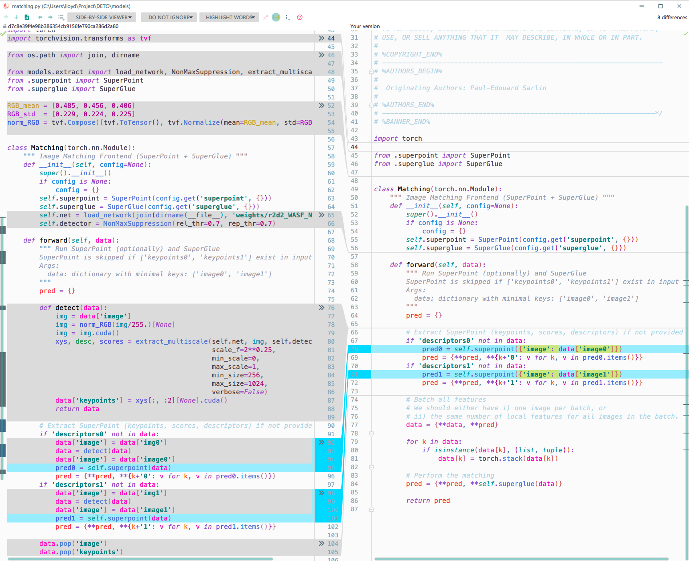

*[English](README.md) | [简体中文](README.zh-CN-simplified.md).*


本仓库是这篇 [论文](https://arxiv.org/abs/2104.00947) 的 **Detector-oblivious** 部分的 Pytorch 实现代码.

> Xuelun Shen, Cheng Wang, Xin Li, Qian Hu, Jingyi Zhang. "A Detector-oblivious Multi-arm Network for Keypoint Matching."

##### 根据我们的发现, 大家仅需要训练一次 [SuperGlue](https://psarlin.com/superglue), 即可在任何关键点检测器后面使用它, 而不需要针对不同的关键点检测器训练不同的 SuperGlue.

---

## ⚙️ 运行环境

代码在我自己这是运行在 `Python (3.8.8)`, `Pytorch (py3.8_cuda11.1_cudnn8.0.5_0)`, `Ubuntu 18.04` 和 `GeForce RTX 3090`.

大家也可以使用其他的运行环境和GPU, 只要代码能顺利运行即可, 应该可以得到和论文中表格相似的结果.

一些必要的包, 大家可以通过下方的命令进行安装:

```bash
pip install numpy opencv-python matplotlib imagesize tqdm h5py imageio
```

---

## 🔨 使用

### 💾 获取测试数据

从 [Google drive](https://drive.google.com/file/d/1qWrZjy1lYe6tB8OWE-Q07HcG5ycm3Fnn/view?usp=sharing) 中下载压缩文件 `data-DETO.zip`, 解压它, 然后把解压后的文件夹名从 `data-DETO` 重命名为 `data`.

(压缩的时候忘记修改文件夹的名字了, 懒得再上传一遍了, 稍微麻烦一下大家.)


### 📦 获取预训练模型

从 [Google drive](https://drive.google.com/file/d/1T5nmIrA13LfSpoKHMAvbXEd0HLcfHAnw/view?usp=sharing) 中下载压缩文件 `weights-DETO.zip`, 解压它, 然后把解压后的文件夹名从 `weights-DETO` 重命名为 `weights`。


### 📁 确认文件结构

将我们刚才重命名的 `data` 文件夹放到源代码文件夹里面.

将我们刚才重命名的 `weights` 文件夹放到源代码文件夹中的 `models` 文件夹里面.

如果我们称命名源代码文件夹为 `DETO`.

那么文件的结构应当如下方:

<details>
<summary><b>[ 🖱️ 点击此处展开 文件结构]</b></summary>

```bash
DETO
│
└───assets
│
└───data
│	│
│	└───MegaDepth
│	│
│	└───scannet
│	│
│	└───sun3d
│	│
│	└───yfcc
│
└───models
    │
    └───weights
		│
		└───r2d2_WASF_256d.pt
		│
		└───r2d2_WASF_N16.pt
		│
		└───superglue_indoor.pth
		│
		└───superglue_outdoor.pth
		│
		└───superpoint_v1.pth
```
</details>

## 📊 复现实验

我们使用 Git 中的 **branch (分支)** 来对应论文表格中的不同实验设置, 并且采用表格中 **p-d-c** 的格式来命名 **(分支)**.

<details>
<summary><b>[ 🖱️ 点击此处展开 表格结果]</b></summary>

<p align="center">
	
</p>
</details>

比如, 我们将分支从 **main** 切换到 **SP-SP-SP**, 然后在分支 **SP-SP-SP** 下运行代码, 我们就可以得到表格编号为 **#1** 的相似实验结果.

所以， 除了目前我们所在的主分支 **main**, 这个仓库还包含 **12** 个分支, 对应着上方表格中的 **12** 个实验.

这样做的好处是, 大家可以通过比较不同分支中的源代码, 轻松查看代码的改动, 了解代码的改动所带来的结果的改动.

<details>
<summary><b>[ 🖱️ 点击此处展开 代码比较]</b></summary>

#### 比如我们比较分支 R2D2-SP-SP 和 SP-SP-SP

<p align="center">
	
</p>
</details>

<details>
<summary><b>[ 🖱️ 点击此处展开 分支跳转]</b></summary>

#### 目前我们在分支 main

|                                    Experiments                                    	|  p   |  d   |  c   |
| :--------------------------------------------------------------------------------------:	| :--: | :--: | :--: |
| 👉[main](https://github.com/Xylon-Sean/Detector-oblivious-keypoint-matcher/tree/main)		|  --  |  --  |  --  |
| [#1](https://github.com/Xylon-Sean/Detector-oblivious-keypoint-matcher/tree/SP-SP-SP)		|  SP  |  SP  |  SP  |
| [#2](https://github.com/Xylon-Sean/Detector-oblivious-keypoint-matcher/tree/R2D2-SP-SP)	| R2D2 |  SP  |  SP  |
| [#3](https://github.com/Xylon-Sean/Detector-oblivious-keypoint-matcher/tree/SP-R2D2-SP)	|  SP  | R2D2 |  SP  |
| [#4](https://github.com/Xylon-Sean/Detector-oblivious-keypoint-matcher/tree/SP-SP-R2D2)	|  SP  |  SP  | R2D2 |
| [#5](https://github.com/Xylon-Sean/Detector-oblivious-keypoint-matcher/tree/SP-SP-RAND)	|  SP  |  SP  | RAND |
| [#6](https://github.com/Xylon-Sean/Detector-oblivious-keypoint-matcher/tree/SP-SP-ZERO)	|  SP  |  SP  | ZERO |
| [#7](https://github.com/Xylon-Sean/Detector-oblivious-keypoint-matcher/tree/SP-SP-ONE)	|  SP  |  SP  | ONE  |
|[#8](https://github.com/Xylon-Sean/Detector-oblivious-keypoint-matcher/tree/SIFT-SIFT-SIFT)| SIFT | SIFT | SIFT |
| [#9](https://github.com/Xylon-Sean/Detector-oblivious-keypoint-matcher/tree/SIFT-SP-SIFT)	| SIFT |  SP  | SIFT |
|[#10](https://github.com/Xylon-Sean/Detector-oblivious-keypoint-matcher/tree/SIFT-SP-RAND)	| SIFT |  SP  | RAND |
|[#11](https://github.com/Xylon-Sean/Detector-oblivious-keypoint-matcher/tree/SIFT-SP-ZERO)	| SIFT |  SP  | ZERO |
|[#12](https://github.com/Xylon-Sean/Detector-oblivious-keypoint-matcher/tree/SIFT-SP-ONE)	| SIFT |  SP  | ONE  |
</details>

## ❤️ 致谢

🥇 This source code is heavily borrowed from [SuperGlue](https://github.com/magicleap/SuperGluePretrainedNetwork). If you use the code in your research, please cite [the SuperGlue](https://github.com/magicleap/SuperGluePretrainedNetwork#bibtex-citation) and follow its [license](https://github.com/magicleap/SuperGluePretrainedNetwork/blob/master/LICENSE).

🥇 The R2D2 code is from [R2D2](https://github.com/naver/r2d2). If you use the code in your research, please cite [the R2D2](https://github.com/naver/r2d2#r2d2-reliable-and-repeatable-detector-and-descriptor) and follow its [license](https://github.com/naver/r2d2/blob/master/LICENSE).

🥇 Data **MegaDepth** is from [D2-Net](https://github.com/mihaidusmanu/d2-net) and [MegaDepth](http://www.cs.cornell.edu/projects/megadepth/).

🥇 Data **yfcc** is from [OA-Net](https://github.com/zjhthu/OANet#generate-training-and-testing-data) and [YFCC100m](http://projects.dfki.uni-kl.de/yfcc100m/).

🥇 Data **scannet** is from [SuperGlue](https://github.com/magicleap/SuperGluePretrainedNetwork#bibtex-citation) and [ScanNet](https://github.com/ScanNet/ScanNet).

🥇 Data **sun3d** is from [OA-Net](https://github.com/zjhthu/OANet#generate-training-and-testing-data) and [SUN3D](http://sun3d.cs.princeton.edu/).


## 📋 改动记录

### 📅 2021 年 4 月 11 日

- 更新实验 **#1** 到 **#12** 的相关代码.

### 📅 2021 年 4 月 25 日

- 更新简体中文的 README.
